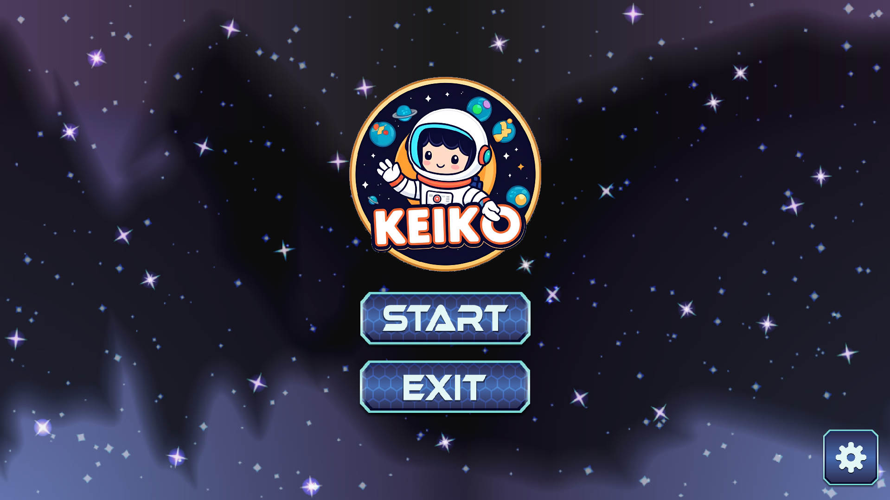
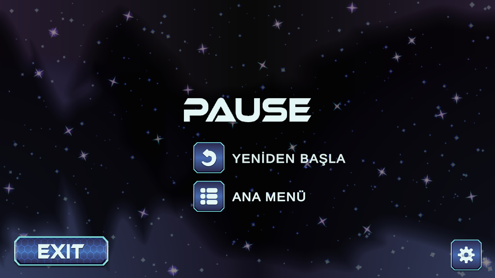
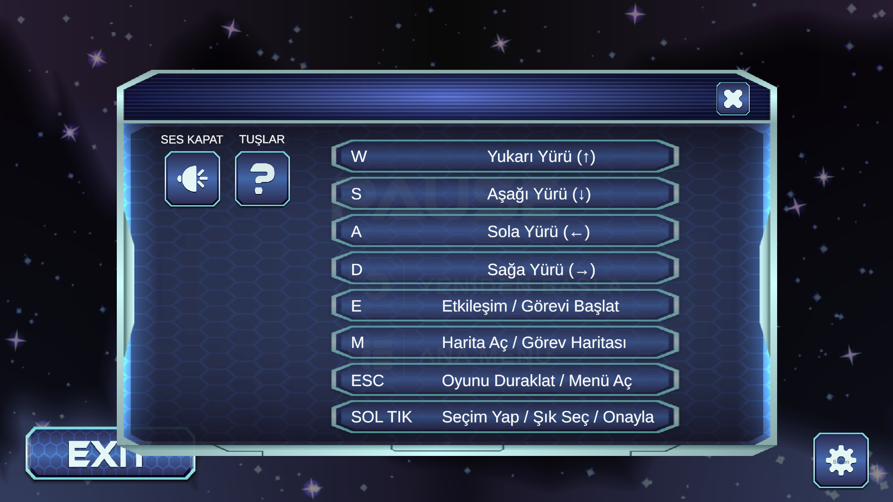
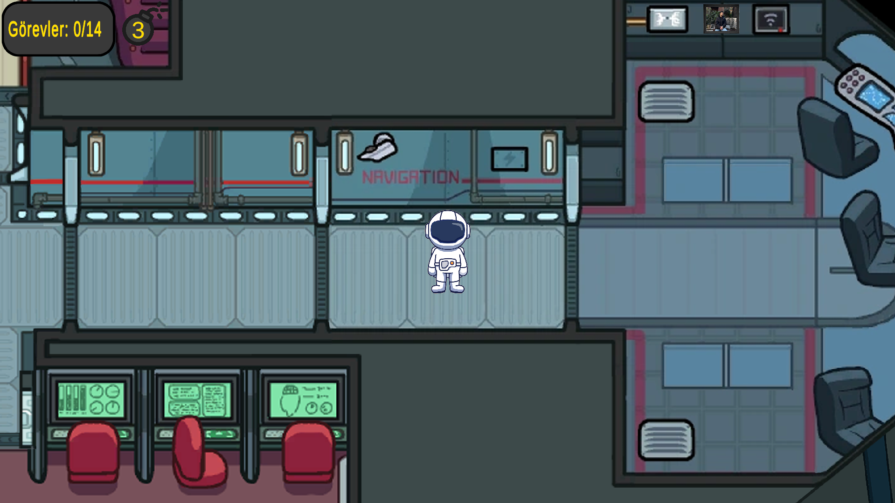
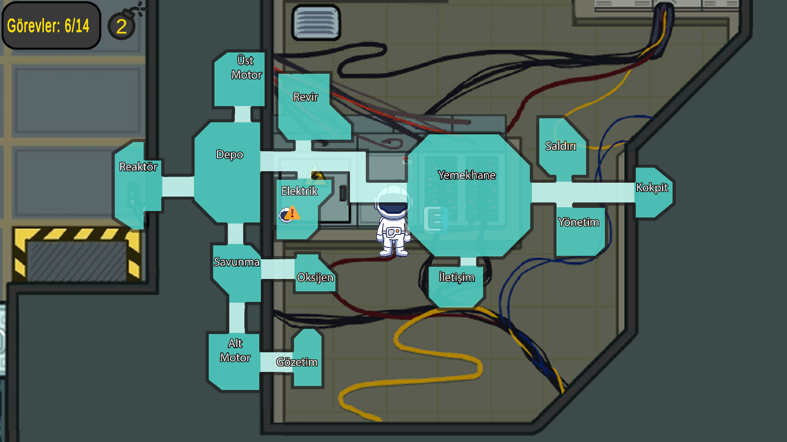
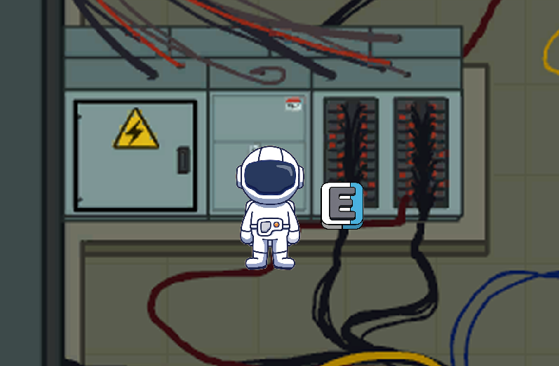
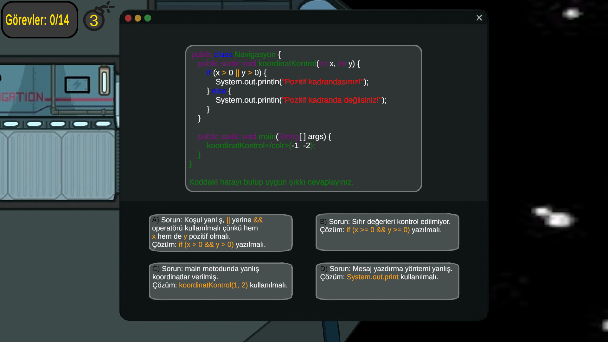
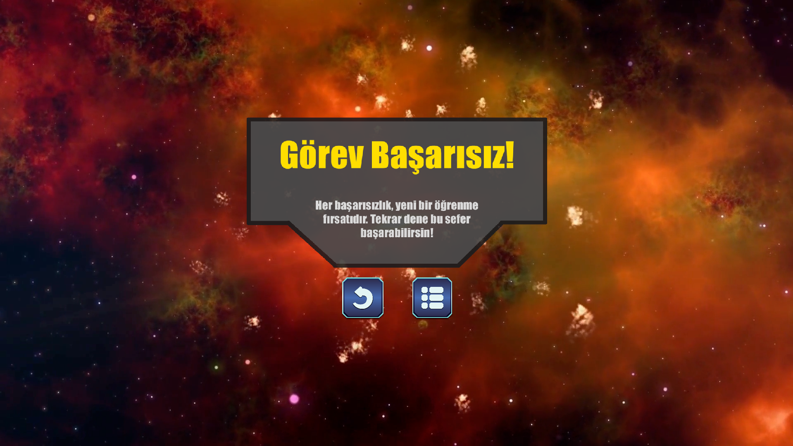

# 🚀 Keiko

**Keiko**, hata düzeltme temalı 2D bir Unity oyunudur.  
Oyuncu, bir uzay gemisinin kaptanı olarak sistemdeki arızaları tespit eder ve her biri farklı türde kod hatalarını temsil eden görevleri tamamlayarak hedefe ulaşmaya çalışır.

---

## 🎮 Oynanış Özellikleri

- 🧠 **Kod Hatalarıyla Dolu Görevler**: Syntax, mantık ve algoritma hatalarını çöz.
- 🕹️ **Minigame Sistemi**: Her odada o odanın içeriğiyle ilgili çoktan seçmeli bir soru çöz.
- 🧭 **Among Us Tarzı Harita**: Oda oda gez, hataları bul.
- 🔧 **Unity 2D** ile geliştirilmiş etkileşimli bir ortam.
- 👨‍🚀 **"E" Tuşu ile Etkileşim**: Arızalı nesnelerle etkileşime geç.
### Sorunu bul! Hatayı çöz! Sonraki soruya ilerle!
---

## 🧩 Kullanılan Teknolojiler & Unity Özellikleri

- Unity 2D & C#
- Photoshop
  
### Unity Engine
-Proje, Unity oyun motoru ile geliştirilmiştir. Tüm scriptler Unity'nin MonoBehaviour tabanlı C# API'sini kullanır.

#### C# Programlama Dili
-Tüm oyun mantığı ve yönetimi C# diliyle yazılmıştır.

#### Unity UI Sistemi
-GameObject, Button, TextMeshProUGUI, RectTransform gibi Unity UI bileşenleri kullanılmıştır.
-UI panelleri, görev göstergeleri, harita, ayarlar ve kontrol panelleri yönetilmektedir.

#### TextMeshPro
-Gelişmiş metin gösterimi için TextMeshPro kullanılmıştır.

#### Unity VideoPlayer
-Oyun sonu ve başarısızlık sahnelerinde video oynatmak için VideoPlayer bileşeni kullanılmıştır.

#### Scene Management
-UnityEngine.SceneManagement ile sahne geçişleri (ana menü, oyun, final, başarısızlık, pause menüsü) yönetilmektedir.

#### Audio Management
-AudioSource ve AudioListener ile arka plan müziği ve efektler kontrol edilmektedir.
-Ses aç/kapat özelliği ve adım sesleri gibi efektler eklenmiştir.

####Input Management
-Klavye girişiyle karakter hareketi, harita açma, mini oyun başlatma ve menü kontrolleri sağlanmaktadır.

#### Oyun Yönetimi (GameManager Pattern)

-Görev yönetimi, panel açma/kapama, hak takibi, görev ilerlemesi gibi oyun akışı GameManager ile kontrol edilmektedir.

#### Coroutine ve Animasyon
-Coroutine ile UI panellerinde titreme efekti gibi animasyonlar yapılmıştır.

#### 2D Physics
-Karakter hareketi ve tetikleyiciler için Rigidbody2D ve Collider2D kullanılmıştır.

---

## 🖼️ Ekran Görüntüleri

---

## 🎥 Oynanış Videoları
[📹 Video 1](Docs/InGameVideo.mkv)
[📹 Video 1](Docs/FailedVideo.mkv)
[📹 Video 1](Docs/FinalVideo.mkv)